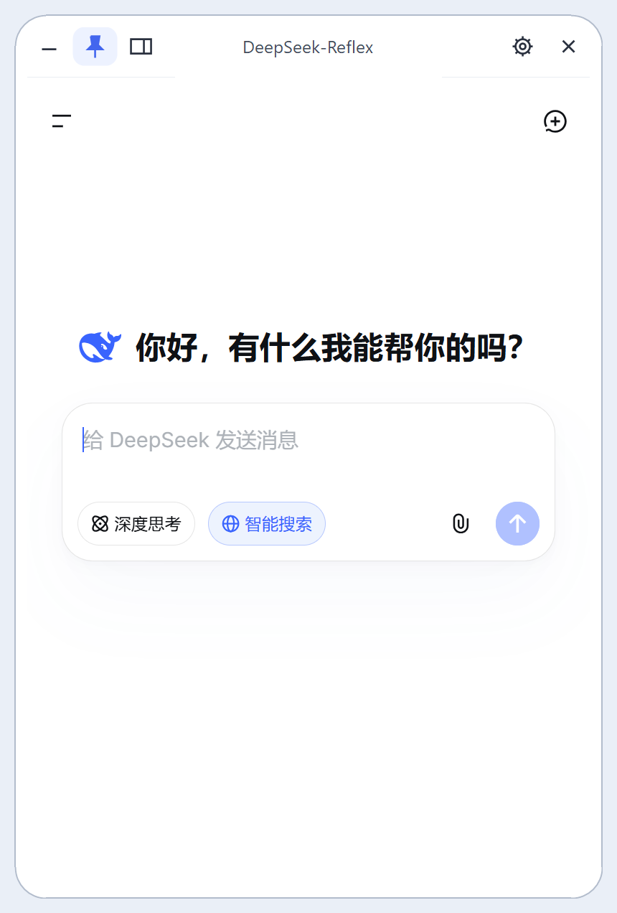
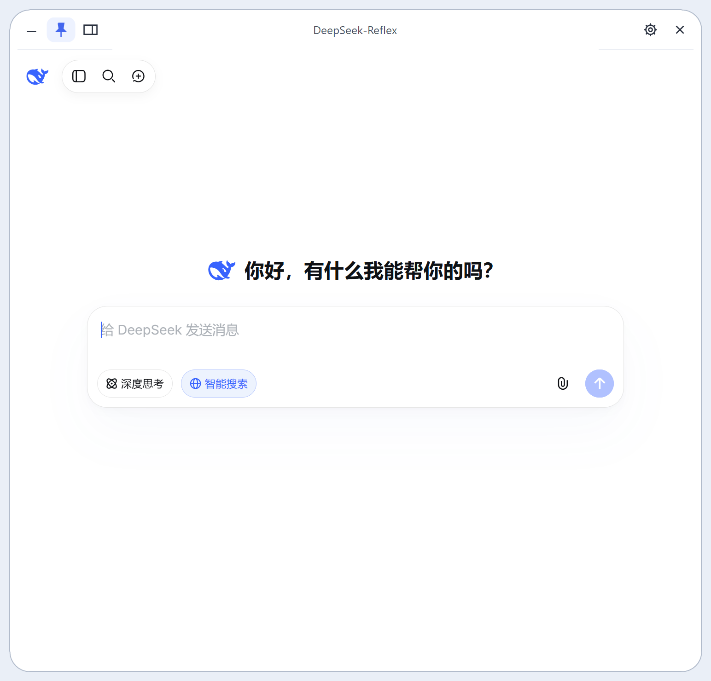
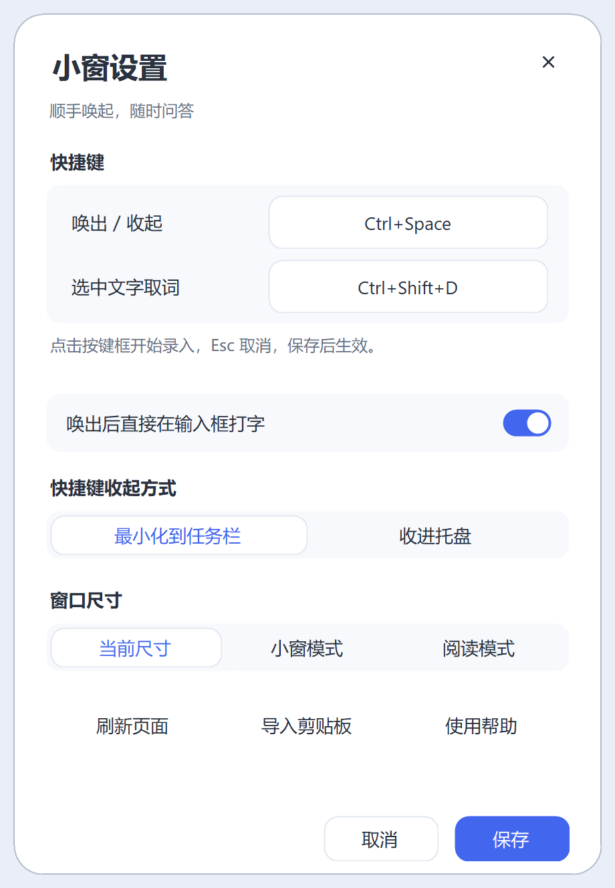
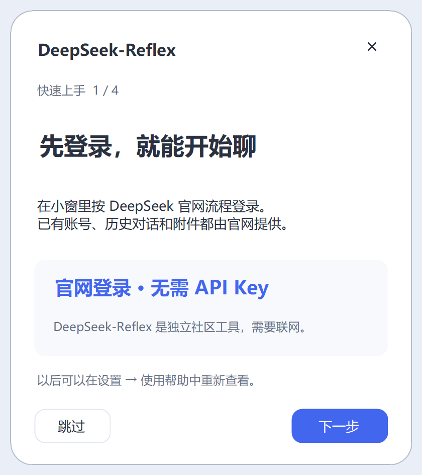

[简体中文](README.md) · English

<p align="center">
  
</p>

<h1 align="center">DeepSeek-Reflex</h1>
<p align="center"><strong>DeepSeek, one shortcut away.</strong><br>A compact Windows chat window with always-on-top controls and global shortcuts.</p>
<p align="center">
  <a href="https://github.com/DOIT-Ben/DeepSeek-Reflex/releases"></a>
  <a href="LICENSE"></a>
  
</p>

Reading, preparing a lesson, or writing code? Press a shortcut to open DeepSeek-Reflex, ask your question, then press it again to get back to work. Reflex is about a quick response: one keystroke instead of finding a browser tab.

**[Download the latest release →](https://github.com/DOIT-Ben/DeepSeek-Reflex/releases/latest)** · [Report an issue](https://github.com/DOIT-Ben/DeepSeek-Reflex/issues) · [Changelog](CHANGELOG.md)

This is an independent community project that loads the [official DeepSeek website](https://chat.deepseek.com). It is not affiliated with or endorsed by DeepSeek.

A skippable introduction appears on first use and can be reopened from Settings. See the [changelog](CHANGELOG.md) for version history.

## Why use it?

| Feature | What it helps with |
| --- | --- |
| Global shortcuts | Open or hide the same window without losing your current conversation. |
| Always on top | Ask questions while reading a document, browsing, or coding. The pin control is in the title bar. |
| Regular website sign-in | Use your DeepSeek account, conversation history, and attachments. No separate API key is needed. |
| Selected-text import | Bring selected text into a draft to translate, explain, or ask about it. Existing drafts are preserved; you review and send. |
| Compact and reading layouts | Use the compact window for quick questions and the wider layout for longer answers. Resize from any edge or corner. |
| Settings panel | Customize shortcuts, hide behavior, input focus, and window size. Content scrolls on smaller screens while the save controls stay visible. |
| Smooth window frame | Rounded corners stay visible while dragging, with animated feedback on buttons and switches. |

Useful for follow-up questions while researching, lesson preparation, translating passages, and quick coding questions. Sign-in and the hosted model service require internet access. Website features and availability are provided by DeepSeek.

## See it in action

Use the compact window for quick questions and switch to the reading layout for longer answers. These are freshly captured screenshots of the current Windows application, showing a fresh signed-in conversation and demonstration text without private information. The application UI is currently in Chinese; both READMEs show the same interface.

<table>
  <tr>
    <td align="center"><strong>Always-on-top chat</strong><br>Pin, hide, or change the layout from the title bar.<br><br></td>
    <td align="center"><strong>Reading layout</strong><br>The same website, with more room for longer answers.<br><br></td>
  </tr>
</table>

<details>
<summary>More screenshots: selected text, settings, and introduction</summary>

### Bring text into a draft, then review and send

Choose Translate, Explain, or Ask in one toolbar. Existing drafts are preserved, and inserting a request never sends it automatically.


### Settings and first-use introduction

An independent panel groups shortcuts, hide behavior, and window layouts. A skippable four-step introduction helps on first use.

<table>
  <tr>
    <td align="center"></td>
    <td align="center"></td>
  </tr>
</table>

</details>

## Download and install

Choose a file from [Releases](https://github.com/DOIT-Ben/DeepSeek-Reflex/releases/latest):

| File | How to use it |
| --- | --- |
| `DeepSeek-Reflex-1.0.15-Setup-x64.exe` | Run the installer. It installs for the current user without administrator privileges, with optional desktop and startup shortcuts. Uninstall through Windows Apps. |
| `DeepSeek-Reflex-1.0.15-Windows-x64.zip` | Extract the entire folder and run `DeepSeekFloat.exe`. Keep all dependency DLLs beside the executable. |
| `SHA256SUMS.txt` | Verify the downloaded files against their SHA-256 checksums. GitHub also provides source archives. |

Requires **Windows 10/11 x64, .NET Framework 4.8, and WebView2 Evergreen Runtime**. V1 has been verified on Windows 11; Windows 10 has not been validated across devices. The installer checks prerequisites and points to [Microsoft WebView2 Runtime](https://developer.microsoft.com/microsoft-edge/webview2/) or [.NET Framework 4.8](https://dotnet.microsoft.com/download/dotnet-framework/net48) if needed. It does not silently download other software. A native ARM64 build is not available.

Current releases are unsigned, so Windows may display an unknown-publisher prompt. See the [signing policy](docs/code-signing.md). Download from this repository's Releases and verify the checksum:

```powershell
Get-FileHash .\DeepSeek-Reflex-1.0.15-Setup-x64.exe -Algorithm SHA256
```

Before upgrading, choose **Exit** from the tray menu. Uninstalling preserves settings and website sign-in data. The ZIP uses the same user data directory as the installed application; moving the extracted folder does not move those data.

The older `DeepSeek.exe` entry point remains supported. It is a blue-fish launcher that opens `DeepSeekFloat.exe` in the same folder, keeping the existing single instance, shortcuts, and sign-in profile. You can run `DeepSeekFloat.exe` directly.

## Getting started

The first visible launch offers a four-step introduction. You can skip it, or reopen it later from **Settings → 使用帮助 (Help)**. Startup in the background waits until you explicitly open the window. The introduction shows your current shortcut settings.

1. Sign in to DeepSeek through the website inside the window.
2. Press **Ctrl+Space** to open or minimize it. You can change the hide action to the tray in Settings.
3. Select text in another application and press **Ctrl+Shift+D**. Choose translation, a student-friendly explanation, or a question about the text; review the draft before sending.
4. The title bar has minimize, pin, and layout controls on the left; Settings and hide are on the right. Closing the window or pressing Alt+F4 hides it to the tray. Choose **退出 (Exit)** in the tray menu to quit.
5. If a shortcut conflicts with another application, click its field in Settings and press a new combination, then save. During recording, Esc cancels and Tab moves to the next control. Duplicate combinations and occupied shortcuts show explicit feedback.

The compact layout is 410×616 DIP and the reading layout is 752×720 DIP, adjusted for available screen space and Windows scaling. Website zoom defaults to 90%. Double-click the title bar to enlarge or restore the window; dragging an edge saves a custom size.

Selected-text import depends on the source application's accessibility support. It first uses Windows UI Automation and may fall back to copying and restoring the clipboard. Password fields, scanned images, empty selections, and input longer than 20,000 characters are not supported. If capture fails, copy the text and use **导入剪贴板 (Import clipboard)** in Settings. The experimental automatic selection popup is disabled by default and has no V1 interface for enabling it.

## Data and privacy

- Uses a dedicated WebView2 profile without copying your regular browser's cookies, passwords, or sign-in data.
- Connects directly to `https://chat.deepseek.com`, without proxying the website, replacing its chat API, or sending conversations to a project server.
- Reads selected text only when you invoke capture or clipboard import. Captured text is not written to application logs; sending the website draft is your decision.
- Includes no project-operated telemetry or analytics service. The embedded website and Microsoft runtime remain subject to their providers' policies.
- Stores user data in `%APPDATA%\cloud.doitbenai.deepseekfloat` and installs by default in `%LOCALAPPDATA%\Programs\DeepSeekFloat`. Older internal directory and executable names are retained for upgrade continuity.

## Build from source

Use **PowerShell 7** at the repository root:

```powershell
git clone https://github.com/DOIT-Ben/DeepSeek-Reflex.git
cd DeepSeek-Reflex
pwsh -NoProfile -File .\webview-host\build.ps1
```

The first build extracts the required files from the pinned official NuGet package `Microsoft.Web.WebView2 1.0.4258.31`. Add `-Offline` once the SDK is cached. The build uses the local .NET Framework C# 5 compiler and targets x64. Rust, Tauri, npm, and an API key are not required.

```powershell
# Install a development build without launching it, then open the application
pwsh -NoProfile -File .\install.ps1 -NoLaunch
pwsh -NoProfile -File .\start.ps1

# Build the installer, ZIP, and checksum files; requires NSIS 3
pwsh -NoProfile -File .\packaging\build-release.ps1
```

Use `-MakeNsisPath <path-to-makensis.exe>` to select the [NSIS](https://nsis.sourceforge.io/Download) compiler and `-OutputDirectory <path>` to choose the release directory. The default `release/` directory is ignored by Git. Both installation methods preserve user data. The development installer backs up managed files before replacing them.

`VERSION` is the version source for assemblies and packages; the application manifest must match it.

## Tests and project layout

```powershell
# Node.js is required only for the simulated input-focus tests
pwsh -NoProfile -File .\webview-host\tests\run-tests.ps1
```

Tests cover settings persistence, shortcut conflict rollback, native window geometry and hit testing, corner synchronization, settings animations, tray behavior, and GDI resource counts. They use test-owned windows and isolated preferences without loading the website or reading an existing account. Focus tests use a simulated DOM; physical shortcuts, cross-application capture, and website sign-in require real usage checks. See the [test notes](webview-host/tests/README.md) (Chinese).

```text
webview-host/     C# / WinForms / WebView2 source, application icon, build and tests
packaging/        Installer definition, release build and quick-start notes
docs/assets/     Original logo and application screenshots
docs/adr/        Edge docking and custom command decisions and independent review
docs/design/     Standalone interaction preview
docs/branding.md Logo notes (Chinese)
.github/         Public build workflow
VERSION          Release version
LICENSE          MIT
```

Issues and pull requests are welcome. See the [contributing guide](CONTRIBUTING.md) (Chinese). Confirmed findings and unverified candidates are tracked in the [bug registry](https://github.com/DOIT-Ben/DeepSeek-Reflex/tree/main/docs/bug-records) (Chinese); recording an issue does not mean it has been fixed.

<details>
<summary>What's next: edge docking and custom commands</summary>

Try tucking the window to an edge and defining your own selected-text commands in the [interaction preview](docs/design/0001-reflex/README.md). [ADR-0001](docs/adr/0001-edge-dock-and-custom-prompts.md) has passed [independent design review](docs/adr/0001-review.md). This is a design preview; these features are not included in the current installed release.

</details>

## License

This project uses the [MIT License](LICENSE). Keep the license and copyright notice when distributing it.

Third-party components retain their own licenses and accompanying notices. The DeepSeek website, service, and trademarks are not covered by this project's MIT license. See [third-party notices](THIRD-PARTY-NOTICES.md) and [branding notes](docs/branding.md).

<details>
<summary>A small note on how this window came about</summary>

I used to turn to Doubao for quick questions. After it introduced [paid services](https://www.doubao.com/legal/ey01), I started using DeepSeek more often: I liked its quick everyday answers and the option to switch to [deeper thinking](https://www.deepseek.com/news/deepseek-v3-1/) for more complex questions. This little window grew out of that habit: open it when a question comes up, tuck it away when you're done, and spend less time switching between windows.

</details>
