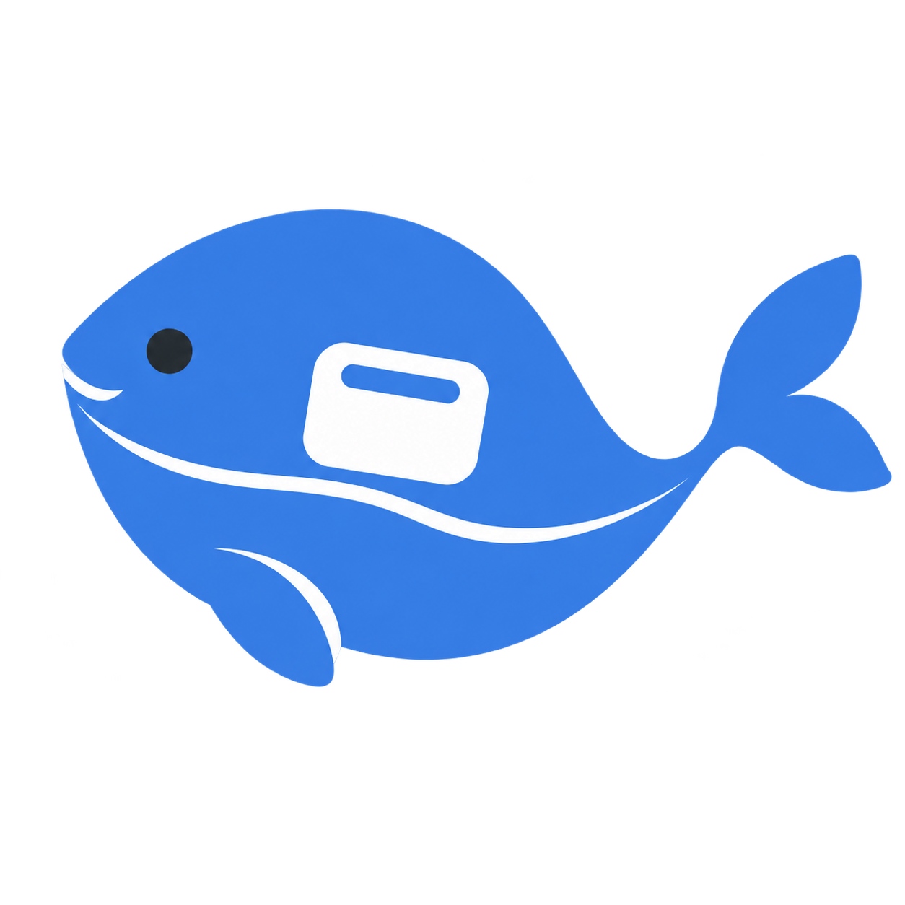

简体中文 · [English](README.en.md)

<p align="center">
  
</p>

<h1 align="center">DeepSeek-Reflex</h1>
<p align="center"><strong>让 DeepSeek 随叫随到。</strong><br>一个轻巧、可置顶、可用全局快捷键唤出的 Windows AI 聊天小窗。</p>
<p align="center">
  <a href="https://github.com/DOIT-Ben/DeepSeek-Reflex/releases"></a>
  <a href="LICENSE"></a>
  
</p>

看文档、备课或写代码时，按一下快捷键就能打开 DeepSeek-Reflex；问完再按一下，继续手头的工作。Reflex 意为“快速响应”，让一次按键代替寻找浏览器标签页。

**[下载最新版 →](https://github.com/DOIT-Ben/DeepSeek-Reflex/releases/latest)** · [问题反馈](https://github.com/DOIT-Ben/DeepSeek-Reflex/issues) · [更新记录](CHANGELOG.md)

这是独立的社区开源工具，直接加载 [DeepSeek 官网](https://chat.deepseek.com)，没有与 DeepSeek 官方的隶属或背书关系。

首次打开有可跳过的使用引导，设置中也能重新查看。版本变化见 [更新记录](CHANGELOG.md)。

## 为什么用它

| 能力 | 带来的便利 |
| --- | --- |
| 随时唤起 | 全局快捷键打开 / 收起同一个聊天窗口，保留当前对话。 |
| 置顶陪伴 | 一边看 Word、网页或代码，一边问问题；置顶开关就在标题栏。 |
| 正常登录 | 使用官网账号、历史对话和附件功能；不需要单独申请 API Key。收起窗口保留当前网页。 |
| 选中文字带入 | 用快捷键把文字带入小窗，翻译、解释或继续提问；保留已有草稿，由你确认后发送。 |
| 小窗与阅读模式 | 小窗随手问，阅读模式看长回答；支持拖动和四边四角拉伸。 |
| 顺手的设置 | 独立设置面板配置唤起键、取词键、收起方式、自动聚焦和窗口尺寸。 |
| 平滑的外框 | 拖动时保留圆角，按钮和开关带有平滑的交互反馈。 |

适合查资料时快速追问、教师备课时解释概念、阅读外文时翻译段落，以及写代码时问一个短问题。官网、模型服务与登录仍需要联网，网站本身的功能和可用性由 DeepSeek 提供。

## 下载与安装

在 [Releases](https://github.com/DOIT-Ben/DeepSeek-Reflex/releases/latest) 选择：

| 文件 | 怎么用 |
| --- | --- |
| `DeepSeek-Reflex-1.0.10-Setup-x64.exe` | 双击安装，当前用户安装，无需管理员权限；可选桌面快捷方式、开机驻留托盘，可从 Windows 应用列表卸载。 |
| `DeepSeek-Reflex-1.0.10-Windows-x64.zip` | 完整解压后运行文件夹里的 `DeepSeekFloat.exe`，无需安装；依赖 DLL 必须和 EXE 放在一起。 |
| `SHA256SUMS.txt` | 对照下载文件的 SHA-256。源码压缩包由 GitHub 自动提供。 |

要求 **Windows 10/11 x64、.NET Framework 4.8、WebView2 Evergreen Runtime**。V1 在 Windows 11 上验证；Windows 10 兼容性尚未逐机验收。安装器会检查运行环境，缺少时提示安装 [Microsoft WebView2 Runtime](https://developer.microsoft.com/microsoft-edge/webview2/) 或 [.NET Framework 4.8](https://dotnet.microsoft.com/download/dotnet-framework/net48)。安装包不静默下载其他软件。ARM64 原生版本尚未提供。

当前发行包未签名，Windows 可能显示未知发布者提示。签名申请与接入情况见 [签名说明](docs/code-signing.md)。请从本仓库 Releases 下载，并核对哈希：

```powershell
Get-FileHash .\DeepSeek-Reflex-1.0.10-Setup-x64.exe -Algorithm SHA256
```

升级前先从托盘右键菜单选择 **退出**。卸载保留个人设置和官网登录资料，重新安装可以继续使用。ZIP 也使用同一用户数据目录；它是免安装版本，数据不会跟着 ZIP 文件夹移动。

早期安装的 `DeepSeek.exe` 入口仍可使用：它现在是一个带蓝鱼图标的小启动程序，打开同目录的 `DeepSeekFloat.exe`，并沿用当前单实例、快捷键和登录资料。正常使用可直接运行 `DeepSeekFloat.exe`。

## 快速上手

首次打开或首次更新到带引导的版本时，会出现四步使用说明。可点“跳过”直接进入聊天，完成或跳过后不再自动弹出；设置 → **使用帮助** 可随时重看。后台开机启动不会弹出引导，等主动唤起小窗后才显示。说明里的唤起键、取词键和收起方式来自当前设置。

1. 第一次打开，在窗口中按官网流程登录 DeepSeek。
2. 默认按 **Ctrl+Space** 唤出 / 最小化小窗；设置中可改成“收进托盘”。
3. 在其他应用选中文字后，按 **Ctrl+Shift+D** 带入小窗；选择翻译、学生解释或理解提问，检查草稿后发送。
4. 标题栏左侧依次为最小化、置顶、尺寸切换；右侧为设置和收起。关闭或 Alt+F4 收进托盘，托盘菜单的“退出”才结束程序。
5. 热键与其他软件冲突时，在设置面板录入新组合键并保存。

小窗为 410×616 DIP，阅读模式为 752×720 DIP；实际尺寸按屏幕空间和 Windows 缩放调整。网页默认缩放 90%。双击标题栏可以放大 / 恢复，手动拉伸会保存自定义尺寸。

取词仍是兼容性功能：优先用 Windows UI Automation，必要时尝试复制并恢复剪贴板。Word、浏览器及其他应用能否取词，取决于其是否提供可访问的文字选择。密码框、扫描图片、空选择、超过 20,000 字的输入不支持直接取词；失败时可先复制，再在设置中“导入剪贴板”。**自动选中文字就弹出浮窗的实验功能默认关闭**，V1 没有自动开启它的界面入口。

## 数据与隐私

- 使用独立 WebView2 profile；不复制普通浏览器的 Cookie、密码或登录资料。
- 直接访问 `https://chat.deepseek.com`，不反代官网、不替换聊天 API、不额外上传对话到项目服务器。
- 快捷键取词或明确导入时才读取文字。选中文字不写入应用日志；带入官网草稿后，发送由用户确认。
- 不含项目自建遥测或统计服务；嵌入的官网和 Microsoft Runtime 仍遵循各自的数据政策。
- 用户数据保存在 `%APPDATA%\cloud.doitbenai.deepseekfloat`；安装位置默认 `%LOCALAPPDATA%\Programs\DeepSeekFloat`。保留旧内部目录与 EXE 名称，方便现有小窗用户沿用资料。

## 从源码构建

克隆后在项目根目录使用 **PowerShell 7**：

```powershell
git clone https://github.com/DOIT-Ben/DeepSeek-Reflex.git
cd DeepSeek-Reflex
pwsh -NoProfile -File .\webview-host\build.ps1
```

首次构建从官方 NuGet 提取固定版本 `Microsoft.Web.WebView2 1.0.4258.31` 的必要文件；已有缓存可加 `-Offline`。使用本机 .NET Framework C# 5 编译器，输出 x64 应用；无需 Rust、Tauri、npm 或 API Key。

```powershell
# 安装开发构建，或通过开关仅安装而不启动
pwsh -NoProfile -File .\install.ps1 -NoLaunch
pwsh -NoProfile -File .\start.ps1

# 生成安装 EXE、免安装 ZIP 和校验文件；需要 NSIS 3
pwsh -NoProfile -File .\packaging\build-release.ps1
```

可用 `-MakeNsisPath <makensis.exe路径>` 指定 [NSIS](https://nsis.sourceforge.io/Download) 编译器，`-OutputDirectory <路径>` 指定发行目录。默认生成在被 Git 忽略的 `release/`。安装脚本与 NSIS 安装器保留用户数据；安装脚本按精确路径发布受管文件并留下覆盖前的恢复副本。

`VERSION` 是版本号唯一输入，程序集和安装包版本由构建生成；应用 manifest 必须保持同版本。

## 测试与项目结构

```powershell
# 需要 Node.js，只用于模拟输入框聚焦的测试
pwsh -NoProfile -File .\webview-host\tests\run-tests.ps1
```

覆盖设置迁移、热键冲突回滚、窗口几何、原生命中、圆角图块同步、设置动画、托盘收起与 GDI 数量。测试使用自有窗口和隔离偏好，不加载官网或读取已有账号内容；聚焦脚本采用模拟 DOM。物理按键、跨应用取词及官网登录需实际试用，详见 [测试说明](webview-host/tests/README.md)。

```text
webview-host/     C# / WinForms / WebView2 源码、应用图标、构建与测试
packaging/        安装器定义、发行包构建与快速说明
docs/assets/     原创高清 Logo
docs/branding.md Logo 创作说明
.github/         公开构建工作流
VERSION          发行版本
LICENSE          MIT
```

欢迎通过 Issue 或 Pull Request 贡献。请参阅 [贡献说明](CONTRIBUTING.md)。

## 开源许可

本项目采用 [MIT License](LICENSE)。分发时请保留许可证与版权声明。

第三方组件保留各自许可证，发行包附带相应声明；DeepSeek 网站、服务及商标不属于本项目的 MIT 授权范围。详见 [第三方声明](THIRD-PARTY-NOTICES.md) 和 [品牌说明](docs/branding.md)。

<details>
<summary>关于这个小窗的一点缘起</summary>

我之前常用豆包随手问问题。它推出[付费服务](https://www.doubao.com/legal/ey01)后，我开始更多使用 DeepSeek：喜欢快速问答时的利落，也喜欢遇到复杂问题时能切到[深度思考](https://www.deepseek.com/news/deepseek-v3-1/)。于是做了这个小窗，让喜欢的问答体验随时唤起、问完收起——少一点切换，多一点顺手。

</details>
